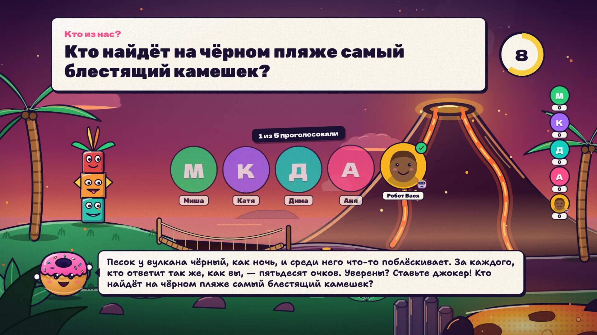
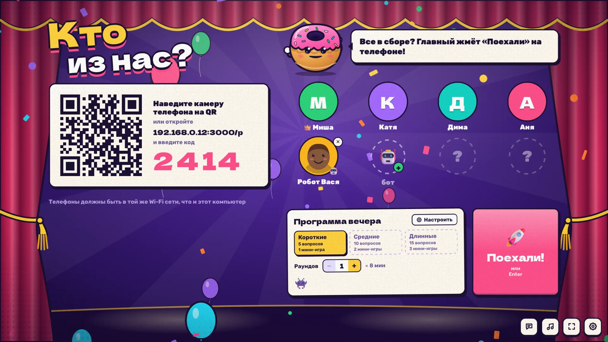
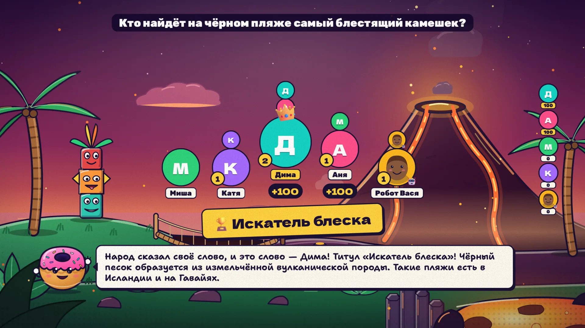
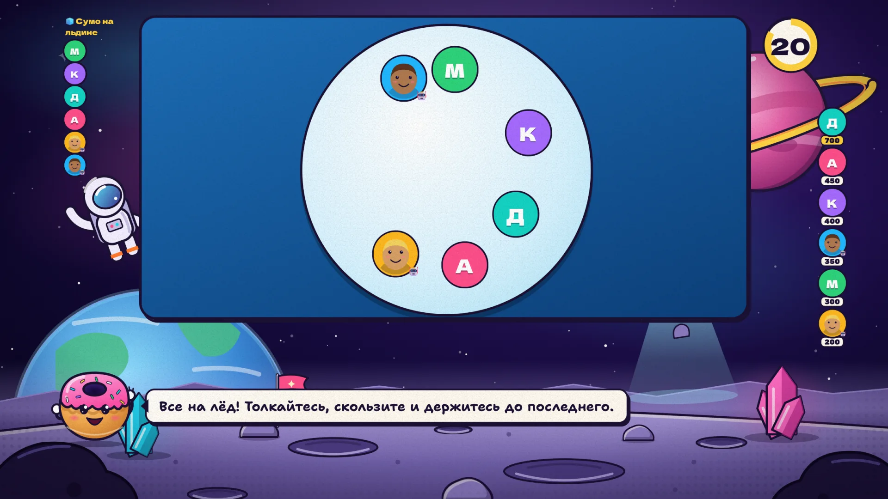
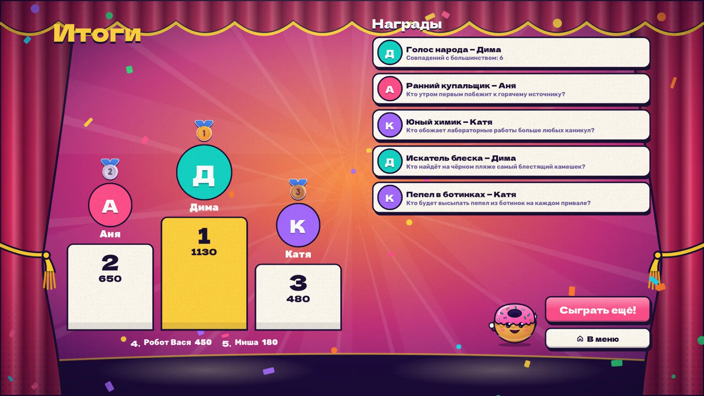
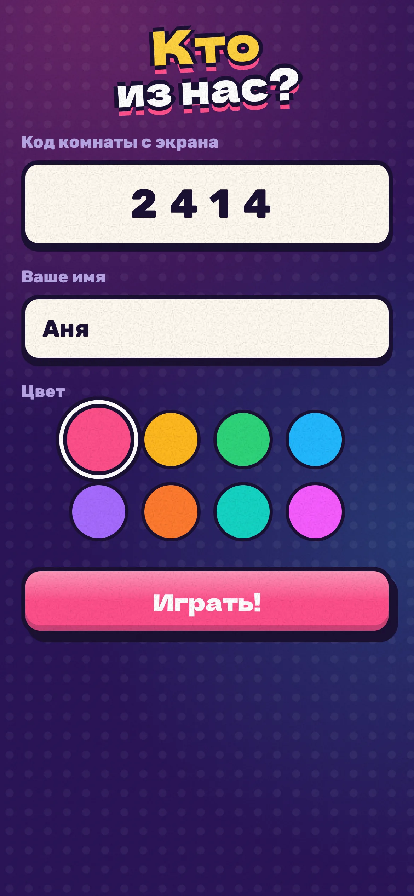
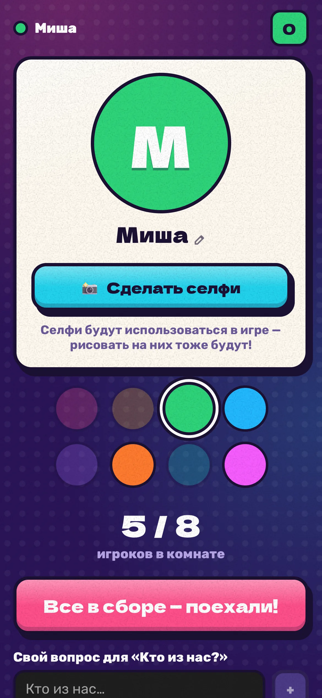
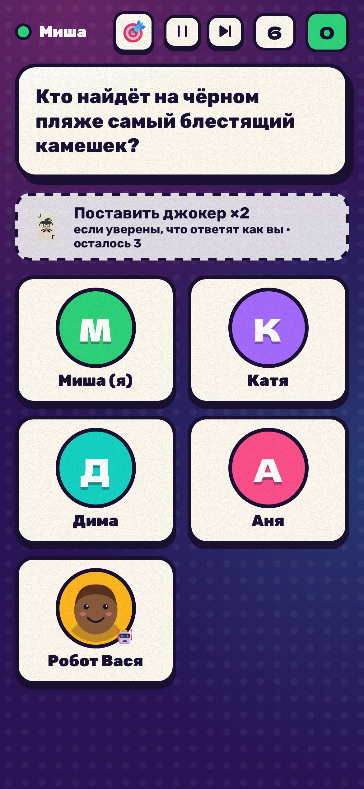
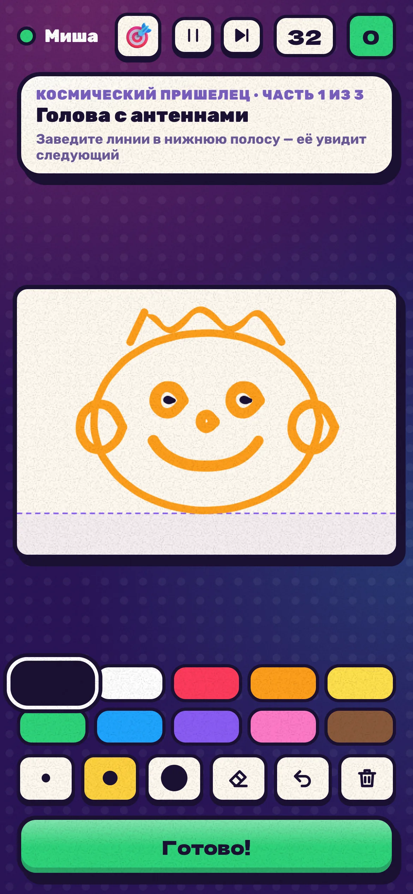

# Кто из нас?

Вечеринка-игра для компании от 2 до 8 человек. Большой экран (ТВ или ноутбук) показывает игру,
игроки подключаются телефонами через браузер — без установки приложений.

**Скачать:** [macOS (Apple Silicon)](https://github.com/swchck/which-of-us/releases/latest/download/kto-iz-nas-macos-arm64.dmg) ·
[Windows](https://github.com/swchck/which-of-us/releases/latest/download/kto-iz-nas-windows-x64-setup.exe) ·
[страница игры](https://swchck.github.io/which-of-us/)



<table>
  <tr>
    <td></td>
    <td></td>
  </tr>
  <tr>
    <td></td>
    <td></td>
  </tr>
</table>

<p>
  
  
  
  
</p>

Партия идёт раундами, как в «Это ты!»:

- **Обычный раунд** — серия вопросов «Кто из нас…?» про всю компанию (кто первым потеряется
  в лесу, кто заплачет на грустном фильме), между ними одна-две мини-игры.
- **Раунд-звезда** — каждый второй раунд Бублик выбирает одного игрока и представляет его в теме
  места («Отправляемся в джунгли! Наш проводник сегодня — Аня…»). Все вопросы раунда — только про
  этого человека: он отвечает, остальные угадывают.

Мини-игры:

- **Угадай ответ** и **Шкала** — вопрос про одного игрока, остальные угадывают его ответ.
- **Дорисуй селфи** — все рисуют поверх селфи друга по заданию.
- **Фото-задание** — все снимают себя по заданию («лицо человека, который…»).
- **Монстр по частям** — голова, туловище и ноги от разных людей, каждый видит только краешек
  предыдущей части.
- **Общая картина** — все по очереди дорисовывают одну картину, у каждого своё подзадание.
- **Нарисуй и угадай** — один рисует секретное слово, остальные пишут догадки с телефонов.
  Неверные ответы всплывают на ТВ, почти верные подсвечиваются «Горячо!».
- **Звездопад** — шарики с селфи игроков катаются по арене на ТВ и собирают звёзды.
  Управление наклоном телефона или экранным джойстиком, шарики толкаются. При 4+ игроках
  иногда играют двумя командами.
- **Кто это написал?** — все дописывают фразу, ответы показываются без имён, угадываем автора.
- **Кто соврал?** — один пишет о себе две правды и одну ложь, остальные ищут враньё.
- **Нарисуй по описанию** — один видит картинку и описывает её словами, остальные рисуют.
- **Продолжи историю** — по строчке, каждый видит только предыдущую.
- **Кто быстрее?** — жмите, когда кнопка позеленеет; синяя — ловушка.
- **Я никогда не…** — честно «было или не было», и угадать, сколько человек скажут «было».
- **Тапалка** — десять секунд жать на кнопку быстрее всех, гонка видна на ТВ.
- **Эмодзи-портрет** — каждому достаётся тайный герой из компании, его описывают тремя эмодзи,
  остальные угадывают, про кого это.

Места действия (17: вечеринка, лагерь, космос, океан, ночной город, джунгли, зимняя сказка,
Дикий Запад, замок с привидениями, ретро-аркада, пляж, цирк, ферма, музей, самолёт, ресторан,
парк динозавров) каждый раз случайные, у каждого своя анимированная сцена и музыка. Игра помнит,
что звучало в прошлые вечера, и сначала берёт то, чего давно не было.

Кнопка «⚙ Игры» в лобби — конструктор партии на трёх вкладках:

- **Игры и места** — готовые наборы («Разговорный», «Художники», «Семейный», «Офисный»,
  «Новогодний»…), выбор мини-игр, мест и тем вопросов («Вечеринка», «Офис», «Семья»,
  «Путешествия», «Еда», «Кино и сериалы», «Школа и детство», «Что если», «Новый год»,
  «День рождения», «Острое 18+»). Свою подборку можно сохранить под именем.
- **Правила и таймеры** — число раундов, вопросов и мини-игр в раунде, раунды-звёзды, можно ли
  голосовать за свою работу, темп и свои таймеры для каждого вида заданий.
- **Свои вопросы** — редактор вопросов трёх типов: «Кто из нас?», «Угадай ответ» с вариантами
  и «Шкала» с подписями концов. Вопросы про одного человека пишутся с `{имя}`. Всё написанное
  запоминается на этом экране и одной кнопкой добавляется в следующую партию.

Перед первой партией каждой игры на экране — карточка с правилами. После финала можно сыграть
ещё раз с теми же настройками или вернуться в меню; во время игры в меню ведёт кнопка ⌂
(нажать дважды).

Кто пришёл, когда игра уже идёт (или мест нет), становится зрителем: голосует в вопросах
«Кто из нас?» без очков, а в следующей партии садится за стол. В конце на телефонах — альбом
вечеринки: лучшие рисунки и фото сохраняются в PNG одной кнопкой.

Ведущий Бублик озвучивает реплики голосом Артёма (или системным голосом), музыка и звуки
генерируются на лету. Телефоны тоже звучат: тихий звонок «твой ход», свой инструмент в «Оркестре».

## Приложение для macOS и Windows

Готовое приложение запускается двойным кликом, без терминала и Node.js. Оно само поднимает
игровой сервер и открывает экран ТВ; при закрытии сервер останавливается.

- **macOS:** откройте `.dmg` и перетащите «Кто из нас» в «Программы». Приложение не подписано
  сертификатом Apple, поэтому первый запуск macOS остановит. Откройте «Системные настройки» →
  «Конфиденциальность и безопасность», внизу нажмите «Всё равно открыть» и подтвердите.
  Дальше оно запускается как обычно. Когда macOS спросит, разрешить ли входящие подключения
  для «Кто из нас», нажмите «Разрешить», иначе телефоны не подключатся.
- **Windows:** установщик `.exe`. Он тоже не подписан, поэтому SmartScreen предупредит о
  неизвестном издателе: «Подробнее» → «Выполнить в любом случае». Установщик попросит права
  администратора: он ставит игру в Program Files и сам открывает ей порт в брандмауэре Windows
  для устройств локальной сети. При удалении правило убирается.

Если что-то не работает (например, ведущий говорит системным голосом), нажмите шестерёнку в правом
нижнем углу → «Помощь» → «Собрать логи». На рабочем столе появится архив `kto-iz-nas-logs-….zip`
с журналом сервера, последними отчётами об ошибках и сведениями о системе — его и пришлите.

Сборка на своём компьютере. Нужны Node.js 25.5+, Rust и [uv](https://docs.astral.sh/uv/);
Windows-сборка делается на Windows, macOS — на Mac:

```bash
cd tts/vosk && uv sync --frozen && cd ../..
```

```bash
node scripts/fetch-vosk-model.mjs
```

```bash
npm run desktop:build
```

Первая команда ставит пакеты движка озвучки, вторая скачивает модель Vosk (около 780 МБ) в
`tts/models/` и сверяет контрольные суммы.

Результат: `desktop/src-tauri/target/release/bundle/`. Если установленный Node собран без
поддержки single executable (так собран Node из Homebrew), скрипт один раз скачает официальный
Node той же версии с nodejs.org, сверит контрольную сумму и положит в `build/node/`.

Как подписать сборки и включить автообновление — в [docs/RELEASE.md](docs/RELEASE.md).

Сборки для обеих систем делает GitHub Actions: workflow `desktop` запускается вручную или по тегу
`v*` и выкладывает `.dmg` и `.exe` в артефакты. По тегу он ещё создаёт черновик релиза с ними.

## Как вывести игру на телевизор

- **HDMI-кабель** от ноутбука — самый надёжный путь.
- **AirPlay** (Mac → Apple TV или телевизор с AirPlay): «Пункт управления» → «Повтор экрана» →
  выберите телевизор и режим «Отдельный монитор». Перетащите окно игры на телевизор и разверните
  кнопкой ⛶.
- **Chromecast**: в Chrome на компьютере ⋮ → «Трансляция…» → «Источники» → «Транслировать
  вкладку». Звук тоже уйдёт на телевизор. Задержка картинки в полсекунды не мешает: время реакции
  в «Кто быстрее?» меряет телефон, а не экран.
- **Браузер смарт-ТВ**: откройте на телевизоре адрес из лобби без `/p` в конце (например,
  `http://192.168.1.2:3000`) и нажмите «Создать игру». Компьютер тогда работает только сервером.
  Пауза и пропуск — с телефона главного игрока, клавиатура не нужна.

Если сервер перезапустится (например, упадёт и поднимется сам в приложении), комната не
пропадёт: телефоны и экран переподключатся и окажутся в лобби той же комнаты с теми же игроками.

## Запуск из исходников

Нужен Node.js 22.12 или новее.

```bash
npm install
```

```bash
npm start
```

Команда соберёт игру и запустит сервер. В терминале появятся адрес для ТВ и QR-код для телефонов.

1. На компьютере, подключённом к ТВ, откройте `http://localhost:3000` и нажмите «Создать игру».
   Для полного экрана нажмите `F`.
2. Игроки сканируют QR-код на экране (или открывают адрес вида `http://192.168.x.x:3000/p`
   и вводят код комнаты).
3. Первый подключившийся — главный: у него на телефоне кнопка «Поехали».

Телефоны должны быть в той же Wi‑Fi сети, что и компьютер. macOS при первом запуске может
спросить, разрешить ли входящие подключения для `node`, — разрешите, иначе телефоны не подключатся.

Играть можно и вдвоём: добавьте ботов кнопкой «Добавить бота» в лобби.

### Управление наклоном

Браузеры дают доступ к датчику наклона только по HTTPS. По умолчанию игра работает по HTTP,
и в «Звездопаде» шарик катают пальцем по джойстику. Чтобы управлять наклоном, включите в лобби
переключатель «Датчики наклона (HTTPS)» до того, как игроки подключатся: QR-код поведёт на
`https://<адрес>:3443`. Сертификат самоподписанный, поэтому телефон один раз покажет
предупреждение — нажмите «Подробнее» → «Перейти на сайт». Сертификат хранится в `~/.kto-iz-nas`
и переиспользуется, пока не сменится адрес компьютера в сети.

### Управление на экране ТВ

| Клавиша | Действие |
|---|---|
| `Пробел` | пауза / продолжить |
| `N` | пропустить текущий этап |
| `F` | полный экран |
| `M` | музыка вкл/выкл |

Кнопки в правом нижнем углу делают то же самое, плюс включают и выключают голос ведущего.

### Нейроголоса ведущего

Ведущий говорит голосом Артёма (Vosk, лицензия весов Apache 2.0, около секунды на фразу на Mac).
Он работает локально, без интернета. Второй вариант в списке «Голос ведущего» — «Системный»: голос,
встроенный в операционную систему, на каждой свой. Подстройка Артёма (скорость, тембр, живость)
записана в `TTS_INFO` в `shared/catalog.ts`. Она входит в ключ кэша, поэтому после её изменения
фразы озвучиваются заново.

Код Chatterbox лежит в `tts/chatterbox/` для будущей отдельной версии с Борисом (см.
`docs/backlog.md`), игра его не предлагает.

Нужен [uv](https://docs.astral.sh/uv/). Движок — отдельное окружение в `tts/<движок>/`:

```bash
cd tts/vosk && uv sync
```

Модель скачивается в `tts/models/` командой `node scripts/fetch-vosk-model.mjs`, около 780 МБ.
Озвученные фразы кэшируются по предложениям в `tts/cache/`, так что каждая фраза синтезируется один
раз. Постоянные реплики ведущего и правила озвучиваются заранее, а во время игры остаются только
фразы с именами:

```bash
npm run tts:prebuild
```

Vosk медленный, поэтому его удобнее
гнать в несколько процессов: `KTO_TTS_THREADS=2 npm run tts:prebuild -- vosk:speaker-3 --shard=0/5`
и так далее до `4/5`.

Готовая озвучка хранится в репозитории, в `tts/voices/`, в Opus. Поэтому свежий клон играет и
собирается без рендера. Сырые MP3 из `tts/cache/` остаются только на машине, где их озвучили.
После озвучки новых фраз их нужно перекодировать в `tts/voices/` и закоммитить:

```bash
npm run tts:bundle
```

Команда кодирует только фразы, которых в `tts/voices/` ещё нет, и удаляет те, которые игра больше
не произносит. Для кодирования нужен ffmpeg с libopus.

В приложение голоса попадают упакованными: по одному файлу с оглавлением на голос
(`scripts/tts-pack.ts`). При первом запуске macOS сверяет с подписью каждый файл приложения. Со ~190
тысячами отдельных фраз это занимало восемь минут, а с упакованными занимает полминуты.

`npm run desktop:build` кладёт в приложение заранее озвученные фразы Артёма и сам движок Vosk:
переносимый Python, его пакеты и модель. Сборка падает, если хоть одной фразы не хватает. Поэтому
на любом Mac с Apple Silicon и на Windows ведущий говорит нейроголосом без установки, а имена и
ответы озвучиваются на лету.

Фразу с именем, которая ещё не озвучена целиком, ведущий говорит по частям: имя между заранее
озвученными кусками текста, а целая фраза тем временем готовится на следующий раз.

Если фраза не успела озвучиться за 3,5 секунды, её прочитает системный голос.

## Разработка

```bash
npm run dev
```

Сервер с горячей перезагрузкой клиента. Игра, как и в обычном режиме, на `http://localhost:3000`.

```bash
GAME_SPEED=4 npm run dev
```

Все таймеры в 4 раза короче — удобно прогонять партию целиком.

```bash
npm run check
```

Проверка типов, линтер, тесты и сборка. Тесты включают полный прогон партии с ботами и
e2e-партию через настоящие WebSocket-подключения.

```bash
npm run test:ui
```

Партия в настоящем Chromium: ТВ и два телефона играют, на каждой сцене тест проверяет, что
ничего не вылезает за экран и не залезает под кнопки, а в консоли нет ошибок.

```bash
npm run load
```

Нагрузка: 8 телефонов рисуют и катают шарики на полной частоте ввода; скрипт печатает RTT и
ровность кадров арены.

Подпись приложения и автообновление описаны в [docs/RELEASE.md](docs/RELEASE.md).
Как выложить веб-версию на свой домен (Docker, Fly.io, свой сервер) — в [docs/DEPLOY.md](docs/DEPLOY.md).

### Устройство

```
shared/    протокол: типы сообщений и состояний, общие для сервера и клиентов
server/    express + ws, комнаты, игровой сценарий, подсчёт очков, боты, контент
client/    Vue 3: host.html — экран ТВ, play.html — телефон
desktop/   приложение на Tauri 2: Rust-обвязка, заставка, иконки, оформление установщиков
scripts/   сборка сервера в один исполняемый файл (Node SEA) для приложения
tests/     unit-тесты, прогон партии с ботами, e2e через WebSocket и HTTPS
```

Сервер авторитетен: таймеры, ответы и очки живут только на нём, клиенты получают снимки
состояния. Поэтому перезагрузка страницы на телефоне или ТВ возвращает в ту же точку игры.
Рисунки передаются векторными штрихами и сохраняются на сервере по мере рисования, так что
истёкший таймер не теряет недорисованное.

Вопросы и задания лежат в `server/content/` — их легко дополнять.

## Лицензия

Код и контент игры — под [GPL-3.0](LICENSE). Шрифты, эмодзи, анимации, звуки, картинки для
рисования и модель голоса Артёма идут под своими лицензиями; их тексты лежат в
[`client/public/licenses/`](client/public/licenses/) и попадают в сборку.
